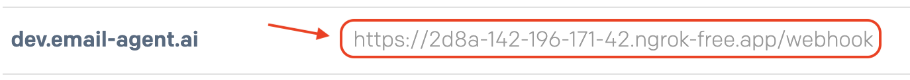
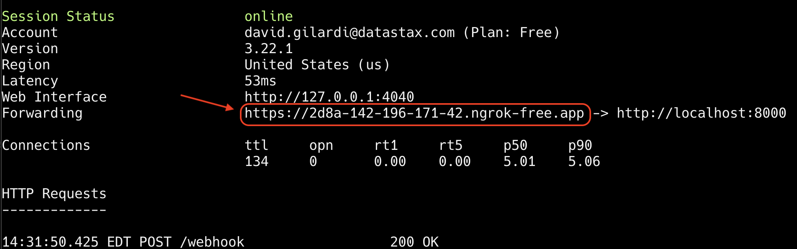

# ✉️ Email as an AI Interface Webhook Handler 🤖 ⚡️

A FastAPI-based webhook handler that transforms email into a natural interface for AI interaction. Using [SendGrid's Inbound Parse](https://docs.sendgrid.com/for-developers/parsing-email/inbound-email), it enables users to communicate with a [Langflow](https://langflow.org) AI agent through their regular email client.

## ✨ Try It Now!

Want to interact with our AI agent? It's as simple as sending an email:

📧 **Email Address:** [`langflow-bot@email-agent.ai`](mailto:langflow-bot@email-agent.ai)

The service will process your email and respond with an AI-generated reply. Try asking questions, requesting analysis, or starting a conversation!

## 🤖 What Can You Ask?

Our AI email interface can handle various types of requests. Simply send your email to [`langflow-bot@email-agent.ai`](mailto:langflow-bot@email-agent.ai) for any of these capabilities:

- 🛍️ **Deals and Shopping** - Find the latest deals and compare prices across retailers
- ✈️ **Travel Planning** - Get personalized recommendations for restaurants, activities, and locations with map links
- 💹 **Financial Information** - Track company performance and market trends in real-time
- 📚 **Research Assistant** - Get comprehensive analysis on academic or technical topics

```
                    Email AI Agent Interface
                    
                         .----------.
                        /          /|
                       /  EMAIL   / |
                      /   /@\    /  |
                     .----------.   |
                     |          |   |
                     |          |  /
                     |          | /
                     .----------.
                           |
                           v
                    +--------------+
                    |   WEBHOOK    |
                    |   HANDLER    |---> [Parse]
                    |              |---> [Clean]
                    +--------------+---> [Extract]
                           |
                           v
                    +--------------+
                    |  AI AGENT    |====> Natural
                    |  PROCESSOR   |====> Language
                    |     </>      |====> Response
                    +--------------+
                           |
                           v
                    [ Smart Response ]
```

## Overview

This service acts as a bridge between [SendGrid's Inbound Parse webhook](https://docs.sendgrid.com/for-developers/parsing-email/inbound-email) and your [Langflow](https://langflow.org) AI agent. It:

1. Receives webhook payloads from SendGrid's Inbound Parse
2. Cleans and sanitizes the email data
3. Extracts relevant information (sender, subject, message text, thread IDs)
4. Forwards the cleaned data to a Langflow endpoint for AI processing
5. 🚧 **Coming Soon:** File attachment handling (images, documents, etc.) - *In Development*

## 🛠 Technology Stack

Our service is built on a modern, robust technology stack:

### Core Technologies
- [Python 3.12+](https://www.python.org/) - Latest Python version with improved performance and features
- [FastAPI](https://fastapi.tiangolo.com/) - Modern, fast web framework for building APIs with Python
- [Langflow](https://langflow.org) - Open-source LangChain Flow implementation for AI agent orchestration
- [SendGrid](https://sendgrid.com/) - Email delivery and webhook processing platform

### Key Dependencies
- [email-reply-parser](https://github.com/zapier/email-reply-parser) - Intelligent email thread parsing
- [python-dotenv](https://github.com/theskumar/python-dotenv) - Environment variable management
- [uvicorn](https://www.uvicorn.org/) - Lightning-fast ASGI server implementation

### Development Tools
- [pytest](https://docs.pytest.org/) - Testing framework for robust test coverage
- [flake8](https://flake8.pycqa.org/) - Code linting and style guide enforcement
- [black](https://black.readthedocs.io/) - Code formatting for consistent style

## Environment Variables

The following environment variables are required:

- `LOG_LEVEL`: Logging level (default: INFO)
- `PORT`: Server port (default: 8000)
- `LANGFLOW_API_URL`: Base URL for Langflow API
- `LANGFLOW_ENDPOINT`: Specific Langflow endpoint to call
- `LANGFLOW_API_KEY`: Optional API key for secured endpoints

### Setting Up Environment Variables

1. Copy the example environment file:
   ```bash
   cp .env.example .env
   ```

2. Edit the `.env` file with your specific configuration:
   ```bash
   # Server Configuration
   PORT=8000
   LOG_LEVEL=INFO

   # Langflow Configuration
   LANGFLOW_API_URL=http://localhost:3000    # Your Langflow instance URL
   LANGFLOW_ENDPOINT=your-flow-endpoint      # Your specific flow endpoint
   LANGFLOW_API_KEY=your-api-key             # Optional: Your API key
   ```

## API Endpoints

### POST /webhook

Receives incoming webhook POST requests from [SendGrid's Inbound Parse](https://docs.sendgrid.com/for-developers/parsing-email/setting-up-the-inbound-parse-webhook).

**Input Fields:**
- `to`: Recipient email address
- `sender`: Sender email address (alias: "from")
- `subject`: Email subject
- `text`: Email body text
- `headers`: Raw email headers

**Response:**
- Success: `{"status": "accepted"}`
- Error: `{"status": "error", "message": "..."}`

### GET /health

Health check endpoint to verify service status.

**Response:**
- `{"status": "healthy"}`

## Features

- **Email Thread Parsing**: Extracts and tracks email conversation threads using [email-reply-parser](https://github.com/zapier/email-reply-parser)
- **Reply Extraction**: Intelligently extracts reply content from email chains
- **Unicode Normalization**: Ensures consistent character encoding
- **Async Processing**: Background task handling using [FastAPI](https://fastapi.tiangolo.com)'s async features

## Installation

### Prerequisites

- Python 3.12+ (developed and tested with Python 3.12.5)
- pip

### Setup

1. Clone this repository:
   ```bash
   git clone https://github.com/SonicDMG/email_agent_interface.git
   cd email_agent_interface
   ```

2. Install dependencies:
   ```bash
   pip install -r requirements.txt
   ```

### Local Development with ngrok

To test the webhook locally, you'll need to make your local server accessible to SendGrid. We recommend using [ngrok](https://ngrok.com/) for this:

1. Install ngrok:
   ```bash
   # Using Homebrew (macOS)
   brew install ngrok

   # Using npm
   npm install ngrok -g

   # Or download directly from https://ngrok.com/download
   ```

2. Start your FastAPI server:
   ```bash
   python -m uvicorn webhook_handler:app --reload --port 8000
   ```

3. In a new terminal, create an ngrok tunnel:
   ```bash
   ngrok http 8000
   ```

4. Copy your ngrok URL (looks like `https://xxxx-xx-xx-xxx-xx.ngrok.io`)

5. Configure SendGrid:
   - Go to [SendGrid's Inbound Parse Settings](https://app.sendgrid.com/settings/parse)
   - Add a new domain or subdomain
   - Set the URL to your ngrok URL + `/webhook` (e.g., `https://xxxx-xx-xx-xxx-xx.ngrok.io/webhook`)
   - Save the settings

Now emails sent to your configured SendGrid address will be forwarded to your local development server through ngrok.


*SendGrid configuration showing the webhook URL (`/webhook` endpoint) for local testing*


*Ngrok console displaying the forwarded traffic to your local webhook endpoint*

The images above show:
1. SendGrid's webhook configuration pointing to your ngrok URL + `/webhook`
2. Ngrok's console showing the incoming webhook requests being forwarded to your local server

Notice how the SendGrid Inbound Parse webhook address matches the address generated by ngrok, ensuring that incoming emails are correctly forwarded to your local development environment.

> **Note**: The free tier of ngrok will generate a new URL each time you restart the tunnel. You'll need to update your SendGrid webhook URL accordingly. For persistent URLs, consider upgrading to a paid ngrok plan.
