# Email AI Agent Webhook Handler

A FastAPI-based webhook handler that processes email notifications from GitHub and forwards them to a Langflow AI agent.

## Overview

This service acts as a bridge between GitHub email notifications and your Langflow AI agent. It:

1. Receives webhook payloads from GitHub email notifications using Composio triggers
2. Cleans and sanitizes the JSON data to ensure proper formatting
3. Extracts relevant information (sender, subject, message text, etc.)
4. Forwards the cleaned data to a Langflow endpoint for AI processing

## Architecture Mindmap

The following mindmap outlines the main flow and responsibilities of the webhook handler:

- **webhook_handler.py**
  - **POST /webhook endpoint**
    - Receives incoming webhook POST requests
    - Extracts raw email data from request
    - Initiates email data parsing
    - Triggers background task for Langflow API POST
  - **Email Data Parsing**
    - Parses email headers (From, To, Subject, etc.)
    - Extracts reply content from email body
    - Retrieves thread ID for conversation tracking
    - Outputs structured email data
  - **Langflow Payload Preparation**
    - Constructs payload for Langflow API
    - Includes parsed email data
    - Formats data according to Langflow API requirements
  - **Background Task (POST to Langflow API)**
    - Runs asynchronously
    - Sends prepared payload to Langflow API endpoint
    - Handles API response
  - **Error Handling**
    - Catches exceptions during parsing and API calls
    - Logs errors
    - Returns appropriate HTTP error responses
  - **Health Check Endpoint**
    - Provides a simple GET endpoint
    - Returns status to indicate service health

**Data Flow:**
POST /webhook endpoint → Email Data Parsing → Langflow Payload Preparation → Background Task (POST to Langflow API) → Langflow API

**Error Handling** applies to all stages. **Health Check Endpoint** operates independently.

## ASCII Architecture Overview
```
Webhook Handler Functions
│
├── Main Functions
│   │
│   ├── webhook POST /webhook
│   │   ├── Inputs
│   │   │   ├── request: Request
│   │   │   ├── background_tasks: BackgroundTasks
│   │   │   ├── to: str Form
│   │   │   ├── sender: str Form
│   │   │   ├── subject: str Form
│   │   │   ├── text: str Form
│   │   │   ├── headers: str Form
│   │   │   └── attachments: int Form
│   │   │
│   │   ├── Processing
│   │   │   ├── Parse email headers
│   │   │   ├── Extract reply text
│   │   │   ├── Determine thread ID
│   │   │   ├── Handle attachments (disabled)
│   │   │   └── Prepare Langflow payload
│   │   │
│   │   └── Output
│   │       ├── Success: {"status": "accepted"}
│   │       └── Error: {"status": "error", "message": "..."}
│   │
│   ├── send_to_langflow (async)
│   │   ├── Inputs
│   │   │   ├── url: str
│   │   │   ├── headers: dict
│   │   │   └── payload: dict
│   │   │
│   │   ├── Processing
│   │   │   ├── Make async HTTP POST request
│   │   │   └── Handle timeouts and errors
│   │   │
│   │   └── Output
│   │       ├── No direct return (background task)
│   │       └── Log success/failure
│   │
│   └── health_check GET /health
│       ├── Input: None
│       ├── Processing: Simple health check
│       └── Output: {"status": "healthy"}
│
├── Supporting Functions
│   ├── clean_text (imported)
│   └── process_attachment (imported, unused)
│
└── Environment Variables
    ├── LOG_LEVEL
    ├── PORT
    ├── LANGFLOW_API_URL
    ├── LANGFLOW_ENDPOINT
    ├── LANGFLOW_FLOW_ID
    ├── CHAT_INPUT_ID
    └── LANGFLOW_API_KEY
```

## Detailed Function Architecture

The following diagram provides a detailed view of all functions, their inputs/outputs, and the environment variables used in the webhook handler:

```mermaid
graph TD
    A[Webhook Handler Functions] --> B[Main Functions]
    A --> C[Supporting Functions]
    A --> D[Key Environment Variables]

    %% Main Functions
    B --> E[webhook POST /webhook]
    B --> F[send_to_langflow async]
    B --> G[health_check GET /health]

    %% webhook details
    E --> E1[Inputs]
    E --> E2[Processing]
    E --> E3[Output]

    %% webhook inputs
    E1 --> E1_1[request: Request]
    E1 --> E1_2[background_tasks: BackgroundTasks]
    E1 --> E1_3[to: str Form]
    E1 --> E1_4[sender: str Form]
    E1 --> E1_5[subject: str Form]
    E1 --> E1_6[text: str Form]
    E1 --> E1_7[headers: str Form]
    E1 --> E1_8[attachments: int Form]

    %% webhook processing
    E2 --> E2_1[Parses email headers]
    E2 --> E2_2[Extracts reply text]
    E2 --> E2_3[Determines thread ID]
    E2 --> E2_4[Handles attachments currently disabled]
    E2 --> E2_5[Prepares Langflow payload]

    %% webhook output
    E3 --> E3_1[status: accepted on success]
    E3 --> E3_2[status: error on failure]

    %% send_to_langflow details
    F --> F1[Inputs]
    F --> F2[Processing]
    F --> F3[Output]

    %% send_to_langflow inputs
    F1 --> F1_1[url: str]
    F1 --> F1_2[headers: dict]
    F1 --> F1_3[payload: dict]

    %% send_to_langflow processing
    F2 --> F2_1[Makes async HTTP POST request]
    F2 --> F2_2[Handles timeouts and errors]

    %% send_to_langflow output
    F3 --> F3_1[No direct return background task]
    F3 --> F3_2[Logs success/failure]

    %% health_check details
    G --> G1[No inputs]
    G --> G2[Simple health check]
    G --> G3[Returns status: healthy]

    %% Supporting Functions
    C --> C1[clean_text imported]
    C --> C2[process_attachment imported unused]

    %% Environment Variables
    D --> D1[LOG_LEVEL]
    D --> D2[PORT]
    D --> D3[LANGFLOW_API_URL]
    D --> D4[LANGFLOW_ENDPOINT]
    D --> D5[LANGFLOW_FLOW_ID]
    D --> D6[CHAT_INPUT_ID]
    D --> D7[LANGFLOW_API_KEY]

    %% Styling
    classDef default fill:#f5f5f5,stroke:#333,stroke-width:2px
    classDef main fill:#e3f2fd,stroke:#2196f3,stroke-width:2px
    classDef support fill:#f3e5f5,stroke:#9c27b0,stroke-width:2px
    classDef env fill:#e8f5e9,stroke:#4caf50,stroke-width:2px

    class A default
    class B,E,F,G,E1,E2,E3,E1_1,E1_2,E1_3,E1_4,E1_5,E1_6,E1_7,E1_8,E2_1,E2_2,E2_3,E2_4,E2_5,E3_1,E3_2,F1,F2,F3,F1_1,F1_2,F1_3,F2_1,F2_2,F3_1,F3_2,G1,G2,G3 main
    class C,C1,C2 support
    class D,D1,D2,D3,D4,D5,D6,D7 env
```



This diagram shows:
- Main function endpoints and their components
- Input/output relationships
- Processing steps for each function
- Supporting utility functions
- Required environment variables

## Interactive Mindmap Visualization

For an interactive visualization of the webhook handler's architecture, you can use the provided HTML mindmap. To view it:

1. Open the `webhook_handler_mindmap.html` file in your browser
2. Use mouse/trackpad to:
   - Click nodes to expand/collapse sections
   - Drag to pan around
   - Scroll to zoom in/out
3. Use the toolbar in the bottom right for additional controls

The mindmap provides an alternative, interactive way to explore the same architecture with:
- Expandable/collapsible nodes
- Pan and zoom capabilities
- Dynamic layout adjustment
- Detailed function information on hover

```html
<!DOCTYPE html>
<html>
<head>
<meta charset="UTF-8">
<meta name="viewport" content="width=device-width, initial-scale=1.0">
<meta http-equiv="X-UA-Compatible" content="ie=edge">
<title>Webhook Handler Functions Mindmap</title>
<style>
* {
  margin: 0;
  padding: 0;
}
#mindmap {
  display: block;
  width: 100vw;
  height: 100vh;
}
</style>
<link rel="stylesheet" href="https://cdn.jsdelivr.net/npm/markmap-toolbar@0.18.10/dist/style.css">
</head>
<body>
<svg id="mindmap"></svg>
<script src="https://cdn.jsdelivr.net/npm/d3@7.9.0/dist/d3.min.js"></script><script src="https://cdn.jsdelivr.net/npm/markmap-view@0.18.10/dist/browser/index.js"></script><script src="https://cdn.jsdelivr.net/npm/markmap-toolbar@0.18.10/dist/index.js"></script><script>((r) => {
          setTimeout(r);
        })(() => {
  const { markmap, mm } = window;
  const toolbar = new markmap.Toolbar();
  toolbar.attach(mm);
  const el = toolbar.render();
  el.setAttribute("style", "position:absolute;bottom:20px;right:20px");
  document.body.append(el);
})</script><script>((getMarkmap, getOptions, root2, jsonOptions) => {
              const markmap = getMarkmap();
              window.mm = markmap.Markmap.create(
                "svg#mindmap",
                (getOptions || markmap.deriveOptions)(jsonOptions),
                root2
              );
            })(() => window.markmap,null,{"content":"Webhook Handler Functions","children":[{"content":"Main Functions","children":[{"content":"webhook (POST /webhook)","children":[{"content":"<strong>Inputs:</strong>","children":[{"content":"request: Request","children":[]},{"content":"background_tasks: BackgroundTasks","children":[]},{"content":"to: str Form","children":[]},{"content":"sender: str Form","children":[]},{"content":"subject: str Form","children":[]},{"content":"text: str Form","children":[]},{"content":"headers: str Form","children":[]},{"content":"attachments: int Form","children":[]}],"payload":{"tag":"li"}},{"content":"<strong>Processing:</strong>","children":[{"content":"Parses email headers","children":[]},{"content":"Extracts reply text","children":[]},{"content":"Determines thread ID","children":[]},{"content":"Handles attachments currently disabled","children":[]},{"content":"Prepares Langflow payload","children":[]}],"payload":{"tag":"li"}},{"content":"<strong>Output:</strong>","children":[{"content":"{\"status\": \"accepted\"} on success","children":[]},{"content":"{\"status\": \"error\", \"message\": \"Internal server error\"} on failure","children":[]}],"payload":{"tag":"li"}}]},{"content":"send_to_langflow async","children":[{"content":"<strong>Inputs:</strong>","children":[{"content":"url: str","children":[]},{"content":"headers: dict","children":[]},{"content":"payload: dict","children":[]}],"payload":{"tag":"li"}},{"content":"<strong>Processing:</strong>","children":[{"content":"Makes async HTTP POST request","children":[]},{"content":"Handles timeouts and errors","children":[]}],"payload":{"tag":"li"}},{"content":"<strong>Output:</strong>","children":[{"content":"No direct return background task","children":[]},{"content":"Logs success/failure","children":[]}],"payload":{"tag":"li"}}]},{"content":"health_check GET /health","children":[{"content":"<strong>Inputs:</strong> None","children":[]},{"content":"<strong>Processing:</strong> Simple health status check","children":[]},{"content":"<strong>Output:</strong> {\"status\": \"healthy\"}","children":[]}]}]},{"content":"Supporting Functions","children":[{"content":"clean_text imported","children":[]},{"content":"process_attachment imported unused","children":[]}]},{"content":"Key Environment Variables","children":[{"content":"LOG_LEVEL","children":[]},{"content":"PORT","children":[]},{"content":"LANGFLOW_API_URL","children":[]},{"content":"LANGFLOW_ENDPOINT","children":[]},{"content":"LANGFLOW_FLOW_ID","children":[]},{"content":"CHAT_INPUT_ID","children":[]},{"content":"LANGFLOW_API_KEY","children":[]}]}]})</script>
</body>
</html>
```

> Note: The HTML mindmap requires a web browser to view. Save the HTML content above to `webhook_handler_mindmap.html` and open it in your browser for the interactive visualization.

## Features

- **JSON Repair**: Automatically fixes malformed JSON using the `json_repair` library
- **Unicode Normalization**: Ensures consistent character encoding
- **Control Character Removal**: Strips problematic control characters from text
- **Message Truncation**: Prevents oversized messages from causing issues
- **Comprehensive Logging**: Detailed logs for debugging and monitoring

## Installation

### Prerequisites

- Python 3.8+
- pip

### Setup

1. Clone this repository:
   ```
   git clone https://github.com/yourusername/email-ai-agent-webhook.git
   cd email-ai-agent-webhook
   ```

2. Install dependencies:
   ```
   pip install fastapi uvicorn requests json-repair
   ```

3. Configure the Langflow endpoint:
   Edit `webhook_handler.py` and update the `LANGFLOW_API_URL` variable to point to your Langflow instance.

## Usage

### Running the Server

Start the webhook handler:

```
python webhook_handler.py
```

The server will run on port 8000 by default.

### Exposing to the Internet

To receive webhooks from GitHub, you'll need to expose your server to the internet. You can use ngrok for development:

```
ngrok http 8000
```

Use the ngrok URL as your webhook endpoint in your GitHub notification settings.

### Health Check

The server provides a health check endpoint at `/health` that you can use to verify it's running correctly.

## Troubleshooting

- Check the `webhook.log` file for detailed logs
- If you're having JSON parsing issues, ensure the `json_repair` library is installed
- For webhook delivery problems, verify your ngrok tunnel is active and the URL is correctly configured

## License

MIT License

Copyright (c) 2025 David Jones-Gilardi

Permission is hereby granted, free of charge, to any person obtaining a copy of this software and associated documentation files.