# Webhook Handler Functions Diagram

```mermaid
graph TD
    A[Webhook Handler Functions] --> B[Main Functions]
    A --> C[Supporting Functions]
    A --> D[Key Environment Variables]

    %% Main Functions
    B --> E[webhook POST /webhook]
    B --> F[send_to_langflow async]
    B --> G[health_check GET /health]

    %% webhook details
    E --> E1[Inputs]
    E --> E2[Processing]
    E --> E3[Output]

    %% webhook inputs
    E1 --> E1_1[request: Request]
    E1 --> E1_2[background_tasks: BackgroundTasks]
    E1 --> E1_3[to: str Form]
    E1 --> E1_4[sender: str Form]
    E1 --> E1_5[subject: str Form]
    E1 --> E1_6[text: str Form]
    E1 --> E1_7[headers: str Form]
    E1 --> E1_8[attachments: int Form]

    %% webhook processing
    E2 --> E2_1[Parses email headers]
    E2 --> E2_2[Extracts reply text]
    E2 --> E2_3[Determines thread ID]
    E2 --> E2_4[Handles attachments currently disabled]
    E2 --> E2_5[Prepares Langflow payload]

    %% webhook output
    E3 --> E3_1[status: accepted on success]
    E3 --> E3_2[status: error on failure]

    %% send_to_langflow details
    F --> F1[Inputs]
    F --> F2[Processing]
    F --> F3[Output]

    %% send_to_langflow inputs
    F1 --> F1_1[url: str]
    F1 --> F1_2[headers: dict]
    F1 --> F1_3[payload: dict]

    %% send_to_langflow processing
    F2 --> F2_1[Makes async HTTP POST request]
    F2 --> F2_2[Handles timeouts and errors]

    %% send_to_langflow output
    F3 --> F3_1[No direct return background task]
    F3 --> F3_2[Logs success/failure]

    %% health_check details
    G --> G1[No inputs]
    G --> G2[Simple health check]
    G --> G3[Returns status: healthy]

    %% Supporting Functions
    C --> C1[clean_text imported]
    C --> C2[process_attachment imported unused]

    %% Environment Variables
    D --> D1[LOG_LEVEL]
    D --> D2[PORT]
    D --> D3[LANGFLOW_API_URL]
    D --> D4[LANGFLOW_ENDPOINT]
    D --> D5[LANGFLOW_FLOW_ID]
    D --> D6[CHAT_INPUT_ID]
    D --> D7[LANGFLOW_API_KEY]

    %% Styling
    classDef default fill:#f9f9f9,stroke:#333,stroke-width:2px;
    classDef main fill:#e1f5fe,stroke:#01579b,stroke-width:2px;
    classDef support fill:#f3e5f5,stroke:#4a148c,stroke-width:2px;
    classDef env fill:#e8f5e9,stroke:#1b5e20,stroke-width:2px;
    
    class A default;
    class B,E,F,G main;
    class C,C1,C2 support;
    class D,D1,D2,D3,D4,D5,D6,D7 env;
```

This Mermaid diagram provides a hierarchical view of the webhook handler's structure. You can view this diagram:
1. In VS Code with a Mermaid preview extension
2. On GitHub (which natively supports Mermaid)
3. On any Mermaid-compatible Markdown viewer
4. Online at [Mermaid Live Editor](https://mermaid.live) 